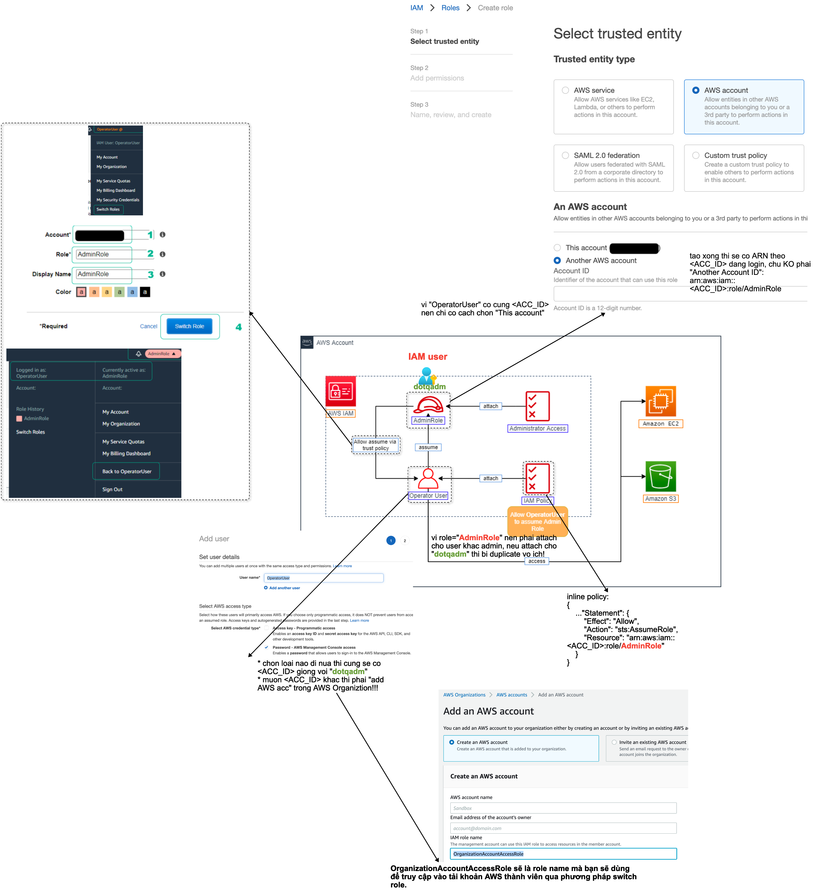

# aws-switchrole-demo 🐳


[](https://github.com/tquangdo/aws-switchrole-demo/issues/new)



## reference
[awsstudygroup](https://000002.awsstudygroup.com/3-switch-roles/)

## AWS CLI với switch role
1. ### reference
    [vtitech](https://vtitech.vn/mot-vai-tips-nho-voi-aws-cli/)
1. ### explain
    1. #### screenshot overview
        - accA=`OperatorUser` & accB=`dotqadm`
        - at accB create role=`AdminRole`
        - add accA's inline policy=
        ```json
            "Action": "sts:AssumeRole",
            "Resource": "arn:aws:iam::<accB ID>:role/AdminRole"
        ```
        - login by accA: can NOT do anything due to NO permission!!!
        - switchRole from accA -> B: can do everything due to `AdminRole` permission
    1. #### vtitech
        - accA=`123456789012` & accB=`?B`
        - at accA create role=`ARole`
        - add accB's inline policy=
        ```json
            "Action": "sts:AssumeRole",
            "Resource": "arn:aws:iam::123456789012:role/ARole"
        ```
        - switchRole from accA -> B:
        ```shell
        [profile accA]
            role_arn = arn:aws:iam::123456789012:role/ARole
            source_profile = accA
        ```